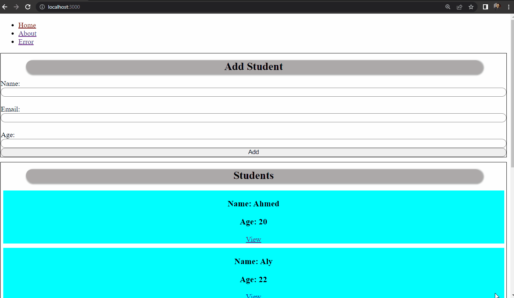

# ReactJS - Lab 2



## Create new project "lab2"
```
$ npx create-react-app lab2
```

## Start 
```
$ npm start
```

## Install [React Router DOM](https://www.npmjs.com/package/react-router-dom)
```
npm i react-router-dom
```
## Authors
* LinkedIn - [Mahmoud Mohamed Kamal](https://www.linkedin.com/in/mahmoudfierro98)

<p align="right">(<a href="#top">Top</a>)</p>
